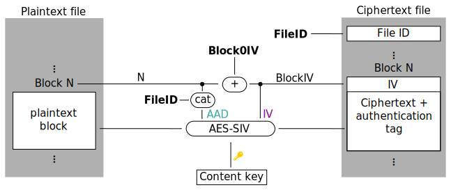
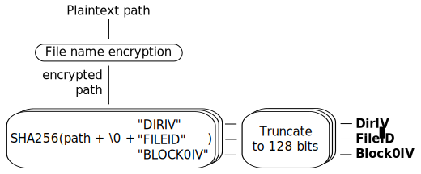

Reverse Mode
============

In **reverse mode**, gocryptfs provides an encrypted view of a
plain-text directory. The primary use-case are encrypted backups.

To make reverse mode useful, it uses deterministic encryption using
AES-SIV instead of AES-GCM.

The differences with respect to the "normal" (forward) mode as detailed
on the [Security](security) page are listed below.

File Contents
-------------

File contents are encrypted using AES-SIV-512 (RFC5297). The 512-bit
AES-SIV key is derived from the 256-bit master key by hashing it with
SHA512.

All values that are random in forward mode (File ID, Block IV)
are instead deterministically derived from the encrypted path, 
essentially using a salted hash (detailed in the section "derivePathIV").
As all derived values are explicitely stored in the ciphertext file,
decryption does not depend on knowledge of the derivation.

The encryption process is shown in the diagram below.

Notes:

1. The IV is passed to AES-SIV as described in section 3 of RFC5297
2. The block number N is contained in the IV as well as in the AAD.
   Either one or the other would suffice, but this construction simplifies
   the decryption process by keeping it identical to forward mode.
   The "duplication" is considered to not have
   any security impact because S2V (RFC5297 section 2.4) hashes IV and
   AAD independently before XORing them together.

File Names
----------

File name encryption is identical to forward mode, with the exception
that the directory IV (stored in `gocryptfs.diriv`) is not random.
It is deterministically derived, using derivePathIV, from the encrypted
path to the directory.

Because the encrypted path to the root directory is "" (the empty string),
this means that the directory IV in the root directory is always
`0xa8f7bac432ddc1cb3dc74e684d6ae48b = SHA256("\0DIRIV")`.

derivePathIV: Derive IVs from Encrypted Paths
----------------------------------------------

derivePathIV concatenates the encrypted path with a null byte and a
salt string (one of "DIRIV", "FILEID", "BLOCK0IV"). This is
is hashed with SHA256 and truncated to 128 bits.

